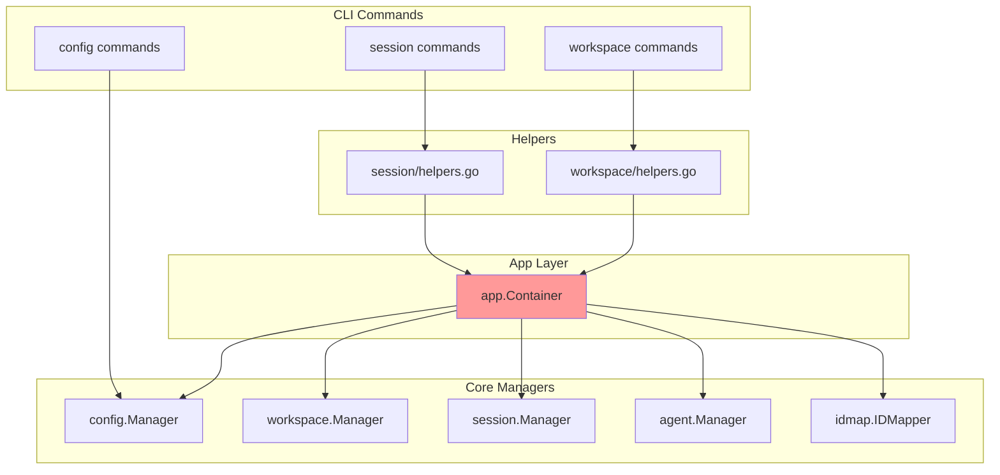
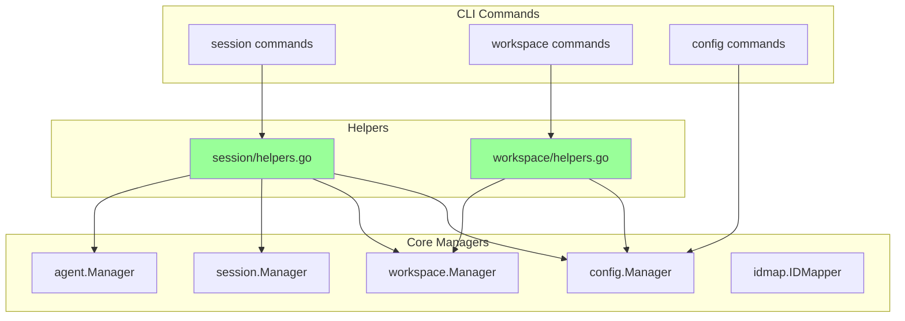
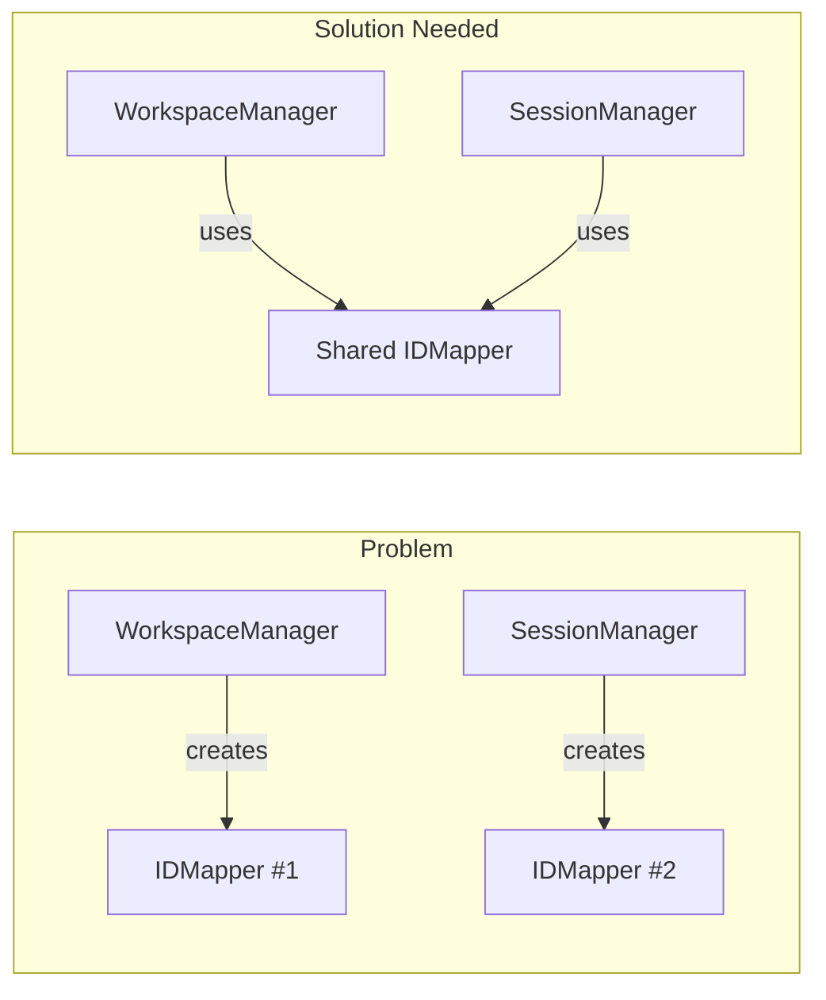

# Container vs Direct Dependencies

## Current State with Container



## Without Container (Direct Dependencies)



## The Real Problems to Solve

### 1. IDMapper Instance Sharing



### 2. Complex Initialization Order

```text
1. ConfigManager (needs projectRoot)
2. IDMapper (needs amuxDir from ConfigManager)
3. WorkspaceManager (needs ConfigManager + IDMapper)
4. AgentManager (needs ConfigManager)
5. SessionManager (needs all above)
```

## Key Insights

1. **Container makes every command depend on ALL managers** (even unused ones)
2. **IDMapper duplication is the main concrete problem** to solve
3. **Initialization order is complex** but happens once per command
4. **Most commands only need 1-2 managers**, not all of them

## Recommendation

Remove Container and solve the real problems directly:

1. Share IDMapper instance between managers
2. Accept some initialization code duplication for clarity
3. Let each command import only what it needs
