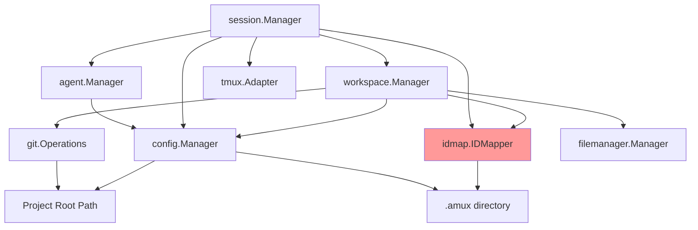

# Manager Dependency Analysis

## Dependency Graph



## Current Initialization Flow

### 1. workspace.Manager

```go
NewManager(configManager) {
    gitOps = git.NewOperations(projectRoot)
    idMapper = idmap.NewIDMapper(amuxDir)  // ← Creates IDMapper
    fileManager = filemanager.NewManager()
}
```

### 2. session.Manager

```go
NewManager(amuxDir, wsManager, agentManager, idMapper) {
    tmuxAdapter = tmux.NewAdapter()
    if idMapper == nil {
        idMapper = idmap.NewIDMapper(amuxDir)  // ← Creates IDMapper AGAIN!
    }
}
```

### 3. agent.Manager

```go
NewManager(configManager) {
    // Simple - only needs config
}
```

## Key Issues

### 1. IDMapper Duplication

- Created by workspace.Manager
- Created again by session.Manager (if not passed)
- Should be created once and shared

### 2. Circular Dependency Risk

- SessionManager needs WorkspaceManager
- WorkspaceManager could need SessionManager in future
- Currently avoided because workspace doesn't import session

### 3. Deep Dependency Chains

```text
CLI Command
  → SessionManager
    → WorkspaceManager
      → GitOps
      → IDMapper
    → AgentManager
    → TmuxAdapter
```

## What Each Manager Really Needs

### workspace.Manager

- **Must have**: ConfigManager (for paths)
- **Must have**: GitOps (for worktree operations)
- **Must have**: IDMapper (for workspace indices)
- **Nice to have**: FileManager (could be internal)

### session.Manager

- **Must have**: WorkspaceManager (to resolve workspace paths)
- **Must have**: IDMapper (for session indices)
- **Optional**: AgentManager (only for agent config)
- **Optional**: TmuxAdapter (only for tmux sessions)

### agent.Manager

- **Must have**: ConfigManager (for agent definitions)
- **Independent**: No dependencies on other managers

## Potential Simplifications

### Option 1: Make IDMapper a Singleton

```go
var (
    idMapperOnce sync.Once
    idMapperInstance *idmap.IDMapper
)

func GetIDMapper(amuxDir string) *idmap.IDMapper {
    idMapperOnce.Do(func() {
        idMapperInstance, _ = idmap.NewIDMapper(amuxDir)
    })
    return idMapperInstance
}
```

### Option 2: Remove Optional Dependencies

- session.Manager doesn't always need AgentManager
- Pass it only when needed (like in run command)

### Option 3: Simplify Factory Pattern

- session.Factory is barely used
- Could be removed entirely
