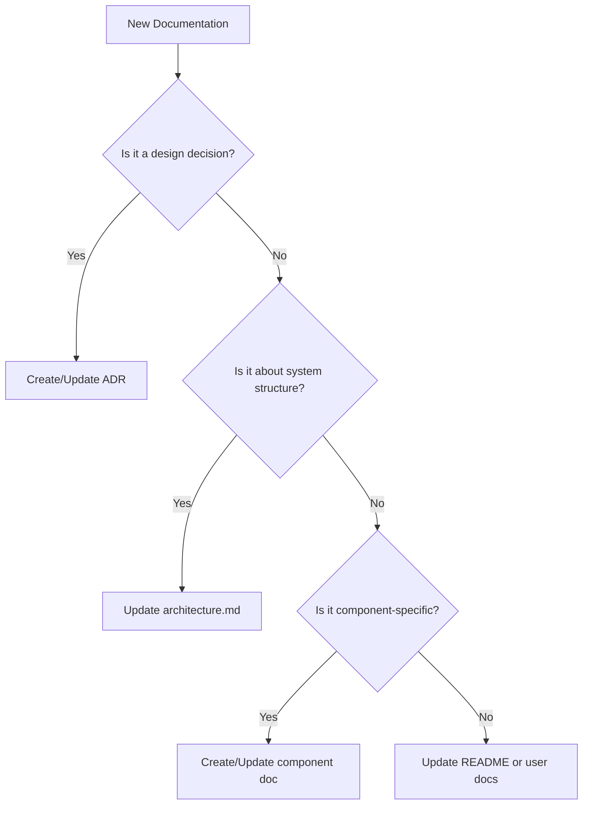

# Amux Documentation Guide

This guide explains our documentation structure and helps you decide where to add new documentation.

## Documentation Types

### 🎯 Architecture Decision Records (ADRs)

**Location**: `docs/adr/`
**Purpose**: Document design decisions and rationale
**When to use**: When making architectural or design decisions

ADRs answer "**why**" questions:

- Why did we choose X over Y?
- What alternatives did we consider?
- What are the trade-offs?
- What are the consequences?

**Example**: [ADR-001: Use Git Worktrees for Workspace Isolation](adr/001-git-worktrees-for-workspace-isolation.md)

### 📐 Architecture Documentation

**Location**: `docs/architecture.md`
**Purpose**: Describe the current system structure
**When to use**: Documenting how the system is organized

Architecture docs answer "**what**" questions:

- What are the main components?
- What are their responsibilities?
- How do they interact?
- What is the directory structure?

**Note**: Reference ADRs for the "why" behind architectural choices.

### 🔧 Component Documentation

**Location**: `docs/{component}.md`
**Purpose**: Detailed technical documentation
**When to use**: Documenting specific subsystems or features

Component docs provide:

- Detailed API documentation
- Configuration options
- Usage examples
- Implementation details
- Troubleshooting guides

**Examples**:

- [MCP Integration](mcp.md)
- Future: Session Management, Agent System

### 📚 User Documentation

**Location**: `README.md`, Wiki, or separate docs
**Purpose**: Help users understand and use Amux
**When to use**: Documenting features, workflows, or tutorials

## Where Should I Document?

Use this decision tree:

## Examples

### Example 1: Choosing a New Library

**Scenario**: You're deciding whether to use library X or Y
**Document in**: New ADR
**Why**: This is a design decision with trade-offs

### Example 2: Adding a New Component

**Scenario**: You've added a new subsystem
**Document in**:

1. Update `architecture.md` to show where it fits
2. Create `docs/{component}.md` for details
3. Create ADR if there were significant design decisions

### Example 3: Changing an Implementation

**Scenario**: You're refactoring how sessions are stored
**Document in**:

1. Create ADR for the decision to change
2. Update component documentation with new details
3. Update architecture.md if structural changes

## Best Practices

### For ADRs

- Keep them immutable once accepted
- Number them sequentially
- Include context, decision, and consequences
- Reference related ADRs
- Be honest about trade-offs

### For Architecture Docs

- Keep descriptions current
- Focus on "what" not "why"
- Use diagrams where helpful
- Reference ADRs for rationale
- Update when structure changes

### For Component Docs

- Include practical examples
- Document both public and internal APIs
- Keep troubleshooting sections updated
- Include performance considerations
- Document configuration options

## Contributing

When contributing documentation:

1. **Check existing docs** - Avoid duplication
2. **Follow the structure** - Use the decision tree above
3. **Cross-reference** - Link between related documents
4. **Keep it current** - Update docs with code changes
5. **Be concise** - Clear and focused documentation

## Quick Reference

| Question | Document Type | Location |
|----------|--------------|----------|
| Why did we choose X? | ADR | `docs/adr/` |
| How does X work? | Architecture/Component | `docs/architecture.md` or `docs/{component}.md` |
| How do I use X? | User docs | `README.md` or component docs |
| What are the trade-offs of X? | ADR | `docs/adr/` |
| What is the structure of X? | Architecture | `docs/architecture.md` |
| What are the details of X? | Component | `docs/{component}.md` |

## References

- [ADR-010: Documentation Structure Strategy](adr/010-documentation-structure.md) - The decision behind this structure
