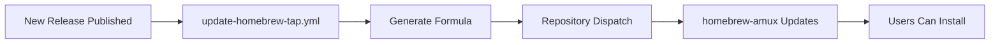

# Homebrew Tap Documentation

This document explains how the Homebrew tap for amux is structured and maintained.

## Repository Structure

Amux uses a separate repository for its Homebrew tap following Homebrew's conventions:

- **Main Repository**: `github.com/choplin/amux` - The amux source code
- **Tap Repository**: `github.com/choplin/homebrew-amux` - The Homebrew formulas

## Why a Separate Repository?

Homebrew requires taps to be complete Git repositories. When users run `brew tap choplin/amux`, Homebrew:

1. Translates this to `github.com/choplin/homebrew-amux`
2. Clones the entire repository
3. Looks for formulas in `/Formula` directory

Subdirectories within the main repository are not supported by the `brew tap` command.

## Automation

The tap is automatically updated when new releases are published:



### Main Repository Workflow

The `.github/workflows/update-homebrew-tap.yml` workflow:

1. Triggers on new releases
2. Downloads release checksums
3. Generates formula from template
4. Sends repository-dispatch event to tap repository

### Tap Repository Workflow

The tap repository has its own workflow that:

1. Receives the repository-dispatch event
2. Downloads the generated formula
3. Commits and pushes the update

## Manual Updates

If automatic updates fail, use the provided script:

```bash
cd scripts/homebrew-tap
./update-formula.sh 0.1.0
```

This generates `amux.rb` with the correct checksums for manual copying to the tap repository.

## Security

The `HOMEBREW_TAP_TOKEN` secret in the main repository must have:

- `repo` scope for the tap repository
- Permissions to trigger workflows

## Testing

Before releasing, test the formula locally:

```bash
# Generate formula
./scripts/homebrew-tap/update-formula.sh 0.1.0

# Test in tap repository
cd /path/to/homebrew-amux
cp /path/to/amux/scripts/homebrew-tap/amux.rb Formula/
brew audit --strict Formula/amux.rb
brew install --build-from-source Formula/amux.rb
```

## Maintenance

- Monitor Homebrew's formula cookbook for best practices
- Update the formula template when adding new dependencies
- Test on multiple platforms before releases
